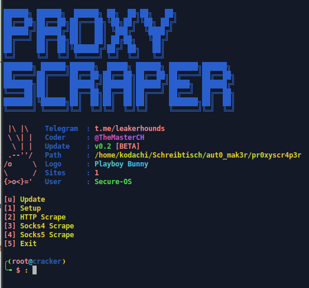

# BASIC AUTO PROXYSCRAPER 



# Table of contents:
* [General Information](#general-info)
* [Changelog](#changelog)
* [Installation](#installation)
* [Disclaimer](#disclaimer)
* [Credits](#credits)
* [Social Media](#social-media)
* [Bug Report](#bug-report)

# General Information

  This is an basic proxy scraper, it's not hard to make. It's used for Cracking purpose to get automatically proxylists
  very fast. I used the proxyscrape.com website, and will add more sources in the next updates. 
  You can send me sources on telegram or pull requests.

# Changelog


 ## In Progress:
 
  *PROCESS STOPPED*
 
  ## Already leaked versions:
  
  **[BETA] Version 0.2**
  
  * Added Update Function
  * Little Changes
  
  **[BETA] Version 0.1:**
  
  * Added 1 Website 

# Disclaimer
  Use this tool for purposes only .:-) 🕵️‍♂️
  If you do any illegal attacks, i am not responsible for your tasks.
  Use this tool correctly, and do not re-upload it on your github repository without permissions.

# Installation

  You can use any linux you want.
  
  ```git clone https://github.com/rebl0x3r/pr0xyscr4p3r.git```
  
  ```cd pr0xyscr4p3r && chmod +x proxy.sh```

  Run:
  
  ```bash proxy.sh```

  Output files in same directory saved as:
  - http.txt
  - socks4.txt
  - socks5.txt

# Credits

* Credits: Rebl0x3r - TheMasterCH

# Social Media
Telegram:
* @TheMasterCH
* @On1c0n3
* @viperzcrew

# Join us at telegram: https://t.me/viperzcrew  

# Bug Report
  If you found any bug or issue, pless go [here](https://github.com/rebl0x3r/pr0xyscr4p3r/issues)
  You can also request an update.
